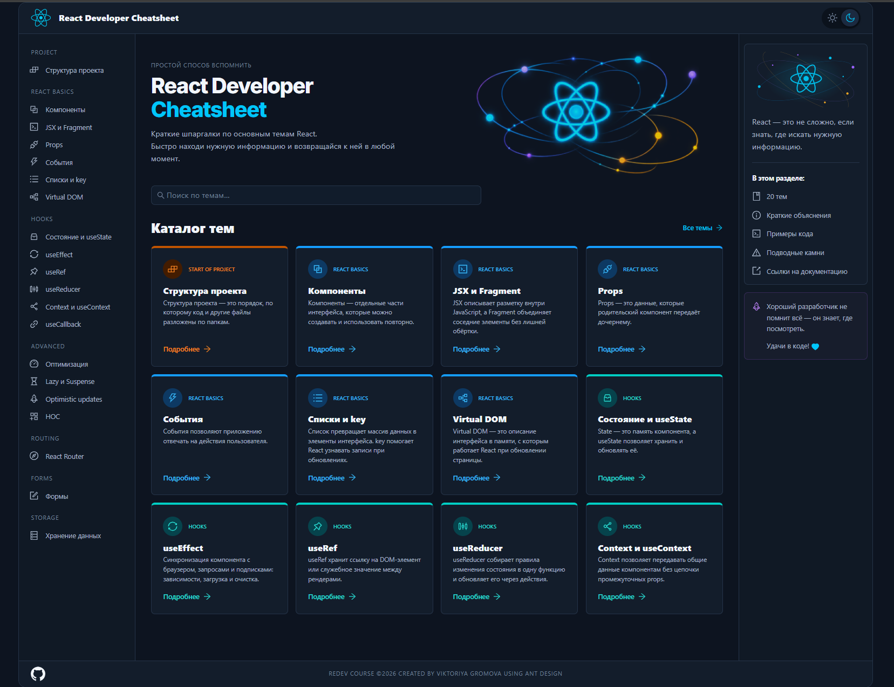
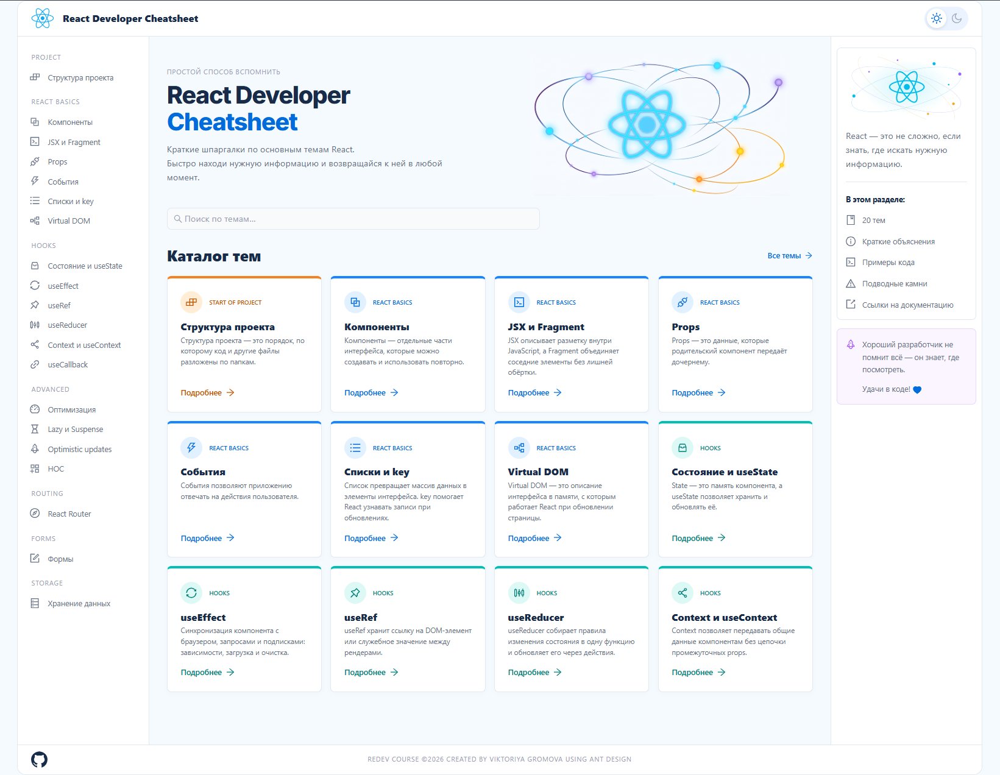

## React Developer Cheatsheet

Шпаргалка по React с понятными объяснениями, примерами кода и подсказками по частым ошибкам. Помогает быстро вспомнить нужную тему и вернуться к практике.

**[Ссылка на прод →](https://react-developer-cheatsheet.netlify.app/)**

## Возможности

* Каталог тем, разделённых по группам.
* Поиск по темам.
* Просмотр сокращённого или полного каталога.
* Объяснения с примерами кода и подсветкой синтаксиса.
* Копирование кода.
* Подводные камни и полезные советы.
* Ссылки на документацию.
* Светлая и тёмная темы с сохранением выбора.
* Адаптивный интерфейс и выдвижное меню на небольших экранах.

## Разделы

* **Project** — структура проекта.
* **Basic** — компоненты, JSX, props, события, списки и основы рендеринга.
* **Hooks** — состояние, эффекты, refs и другие хуки React.
* **Advanced** — оптимизация и дополнительные возможности React.
* **Routing** — навигация с React Router.
* **Forms** — формы и обработка пользовательского ввода.
* **Storage** — хранение данных в браузере.

## Технологии

* React и JavaScript.
* React Router — маршрутизация.
* Ant Design и Ant Design Icons — компоненты интерфейса и иконки.
* React Syntax Highlighter — подсветка примеров кода.
* CSS — оформление, адаптивность и цветовые темы.
* LocalStorage — сохранение выбранной темы.
* Netlify — публикация приложения.

## Организация материалов

Материалы хранятся отдельно от компонентов интерфейса в массиве объектов. Каждая тема содержит пояснения, примеры кода, советы, подводные камни и ссылку на документацию.

Общие компоненты отвечают за отображение этих данных: карточки каталога, разделы статьи, блоки кода и боковые панели.

## О проекте

Учебный проект для практики React: работа с компонентами, props, состоянием, контекстом, маршрутизацией и адаптивной вёрсткой.

Цель — создать удобную шпаргалку, которой можно пользоваться и во время обучения, и при работе над следующими проектами.
